# IT_WAVE README

  * [🏖️ Project Overview / 프로젝트 개요](#----project-overview----------)
  * [🖥️ 수행 도구](#---------)
  * [🛠️ 기능](#------)
  * [📖 프로젝트 아키텍처 및 설계](#-----------------)
  * [🙋🏻‍♂️ 수행 역할](#-------------)
  * [👩‍💻배운점 / 느낀점](#--------------)


## 🏖️ Project Overview / 프로젝트 개요

|                                                              |                                                              |
| ------------------------------------------------------------ | :----------------------------------------------------------- |
| 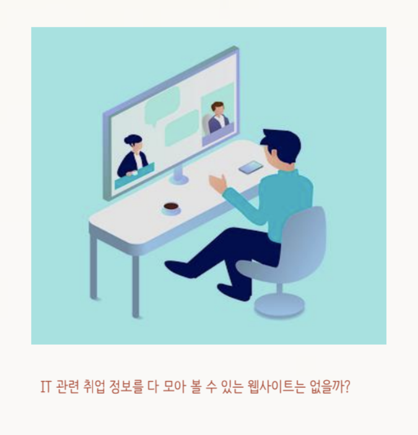 | ▪기획 의도<br />&nbsp;&nbsp;&nbsp;&nbsp;▫ IT 취업 준비생들이 필요로 하는 취업정보 (채용공고, 공모전, 뉴스)를 모아서 보여줄수 있는 웹사이트를 기획<br />&nbsp;&nbsp;&nbsp;&nbsp;▫ IT 현업 종사자, 다른 취업 준비생들과 소통하고 커리어를 쌓아갈 수 있는 커뮤니티를 기획<br /><br />▪ 웹사이트 링크: [www.itwave.site<br />](http://www.itwave.site)<br />▪ 프로젝트 포트폴리오: [컨디션난조_IT_WAVE_포트폴리오.pdf](https://drive.google.com/file/d/1sfaWo-qPXVE2zhVZeB6UsbKWGWvh6neN/view?usp=sharing) |


## 🖥️ 수행 도구 / 실행 방법

<p align="left">
&nbsp
 &nbsp
  &nbsp
&nbsp
 &nbsp</br>
&nbsp
&nbsp
&nbsp
&nbsp
&nbsp
</p>&nbsp&nbsp&nbsp&nbsp
**필요 패키지 설치**

```python
pip install -r requirements.txt
```

**서버 실행**

```python
python manage.py runserver
```


## 🛠️ 기능

1. 개발 직군과 관련있는 **채용공고, 뉴스, 공모전을 보여줌**

2. 스터디 모집 및 채팅

3. 개발자 대상 설문 데이터 시각화


▪ **메인 화면**

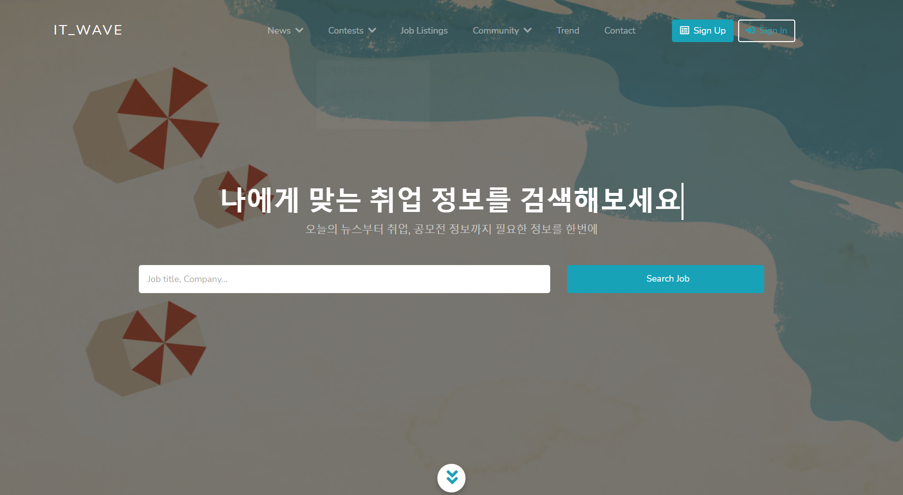

​	▫ 회원 여부를 판단하여 로그인과 회원 가입을 할 수 있다.

​	▫ 뉴스, 공모전, 채용, IT Trend, 스터디 게시판에 입장할 수 있다.

▪ **뉴스 / 공모전 / 채용**

​	▫ 회원 상관 없이 입장 가능

​	▫ 뉴스 게시판

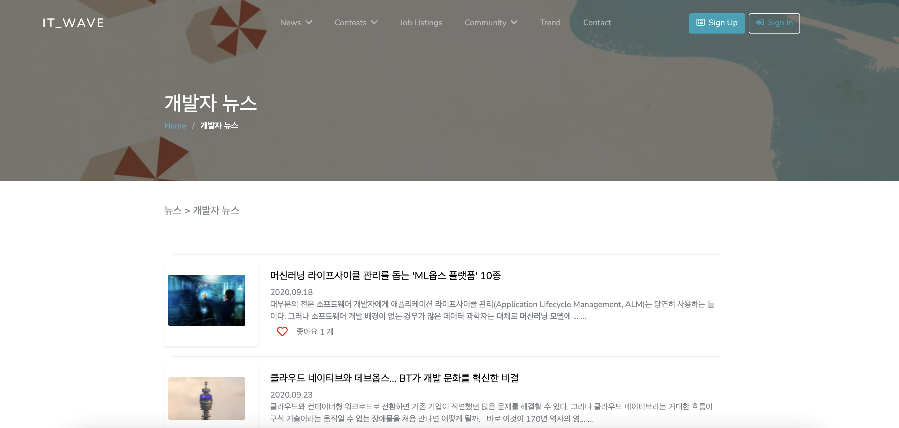

▫ 공모전 게시판

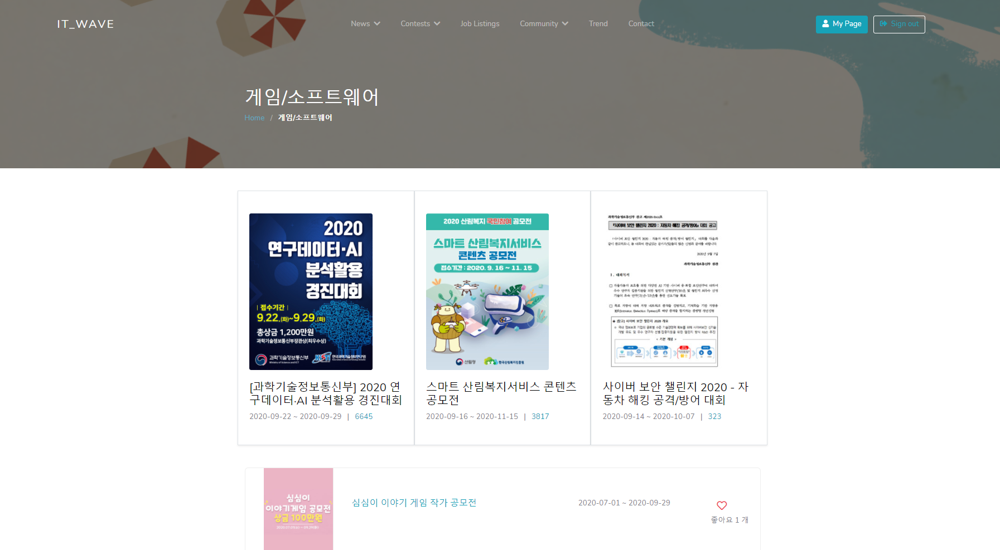

▫ 채용 공고 게시판

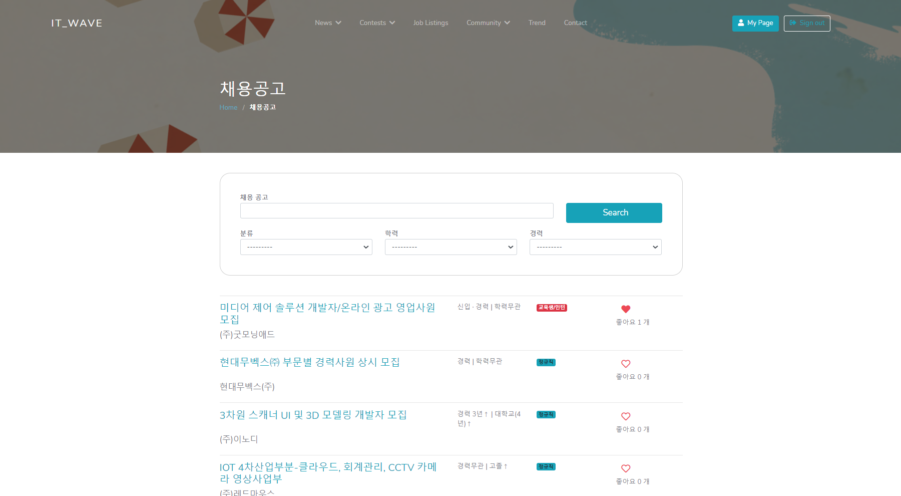

▪ **IT Trend 게시판**

​	&nbsp;&nbsp;&nbsp;&nbsp;▫ IT Trend 관련 데이터를 분석 / 시각화 하여 필요한 인사이트를 보여주는 IT Trend 페이지

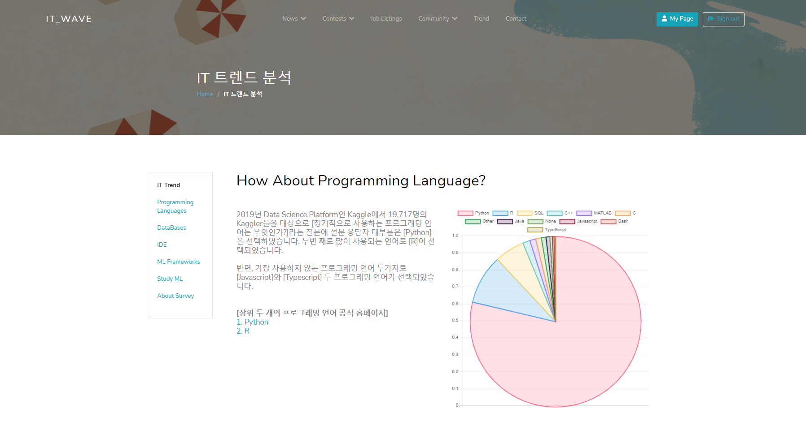

▪ 마이 페이지

​	&nbsp;&nbsp;&nbsp;&nbsp;▫ 내 정보 / 스터디 / 좋아요 한 뉴스, 채용공고, 공모전이 한꺼번에 관리할 수 있는 정보 페이지

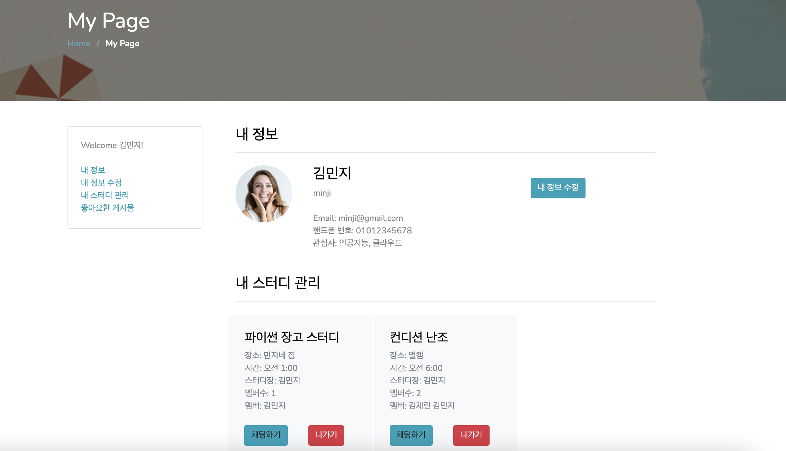

▪ **스터디 게시판**

​	&nbsp;&nbsp;&nbsp;&nbsp;▫ 로그인 여부를 판단하여 로그인이 된 경우에만 접속 허용

​	&nbsp;&nbsp;&nbsp;&nbsp;▫ 새로운 스터디 등록, 스터디 가입 기능

▪ **스터디 상세 페이지**

​	&nbsp;&nbsp;&nbsp;&nbsp;▫ 스터디 가입 여부를 판단하여, 스터디 채팅 및 탈퇴 가능

## 📖 프로젝트 아키텍처 및 설계

### ◾ 기능 분해도

&nbsp;&nbsp;&nbsp;&nbsp;▫ 서비스 전체에 필요한 기능과 페이지들을 나열하고 어떻게 구성되어 있는지를 작성한 기능 분해도

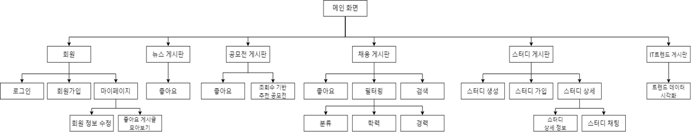

### ◾ 기능 플로우 차트

&nbsp;&nbsp;&nbsp;&nbsp;▫ 서비스의 흐름의 구성을 설명한 기능 플로우 차트

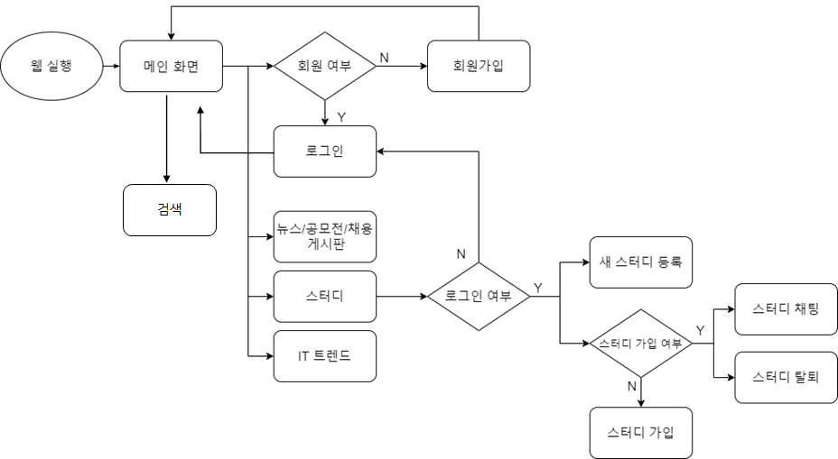

### ◾ ERD

&nbsp;&nbsp;&nbsp;&nbsp;▫ 데이터베이스의 구조와 관계 설정을 기술한 ERD

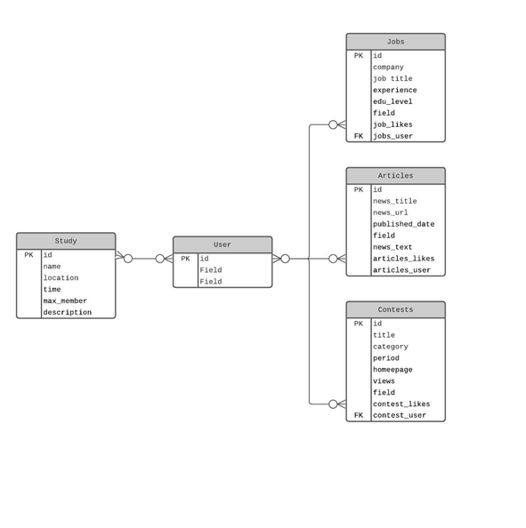

### ◾ 시스템 아키텍처

&nbsp;&nbsp;&nbsp;&nbsp;▫ 웹 서비스의 아키텍처가 어떻게 구성되어있는지 도식화 해서 표현한 시스템 아키텍처

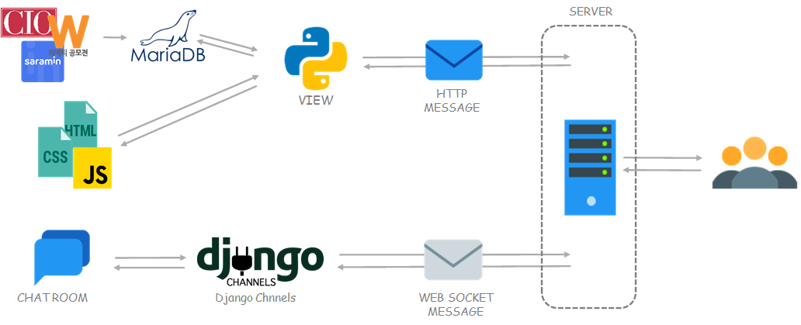

## 🙋🏻‍♂️ 수행 역할

▪ **유찬영 (팀장)**

​	&nbsp;&nbsp;&nbsp;&nbsp;▫ Django 웹 프레임워크 사용

​	&nbsp;&nbsp;&nbsp;&nbsp;▫ Django Channels를 이용한 채팅 기능 구현

​	&nbsp;&nbsp;&nbsp;&nbsp;▫ BeatifulSoup와 Request 라이브러리를 이용한 웹스크래핑

​	&nbsp;&nbsp;&nbsp;&nbsp;▫ pandas, matplotlib, seaborn을 사용한 데이터 시각화

​	&nbsp;&nbsp;&nbsp;&nbsp;▫ Docker와 AWS EC2를 이용한 배포

▪ **김민지**

​	&nbsp;&nbsp;&nbsp;&nbsp;▫ Django Web Framework를 사용한 스터디 생성 / 가입 기능 구현

​	&nbsp;&nbsp;&nbsp;&nbsp;▫ Django Filters 모듈을 활용하여 검색 / 필터 기능 구현

​	&nbsp;&nbsp;&nbsp;&nbsp;▫ BeatifulSoup와 Request 라이브러리를 이용한 웹스크래핑

​	&nbsp;&nbsp;&nbsp;&nbsp;▫ Bootstrap을 활용한 웹페이지 디자인 및 구성

​	&nbsp;&nbsp;&nbsp;&nbsp;▫ Docker와 AWS EC2를 이용한 배포

▪ **김채린**

​	&nbsp;&nbsp;&nbsp;&nbsp;▫ AWS RDS 구현 (Maria DB)

​	&nbsp;&nbsp;&nbsp;&nbsp;▫ 로그인 / 회원 가입 /  회원 정보 수정 기능 구현

​	&nbsp;&nbsp;&nbsp;&nbsp;▫ 좋아요 기능 구현

​	&nbsp;&nbsp;&nbsp;&nbsp;▫ Docker와 AWS EC2를 이용한 배포

​	&nbsp;&nbsp;&nbsp;&nbsp;▫ BeatifulSoup와 Request 라이브러리를 이용한 웹 스크래핑

## 👩‍💻배운점 / 느낀점

▪  프로젝트 안에서 각자의 맡은 역할을 명확하게 정의하고 그것들을 실행하기 위한 계획을 함께 짜고 실천하는 것이 중요하다는 것을 배웠다

▪  여러 사람들이 같이 프로젝트를 진행할 때 효율성을 높이기 위해 코딩 능력 만큼이나 중요한 것이 잘 설립된 개발 환경이라는 것을 배웠다.

▪  이론 공부 뿐만 아니라 스스로 생각하고 스스로 로직을 짜서 코드를 작성하는 것이 실력을 높일 수 있는 가장 좋은 방법이라고 생각이 들었다.

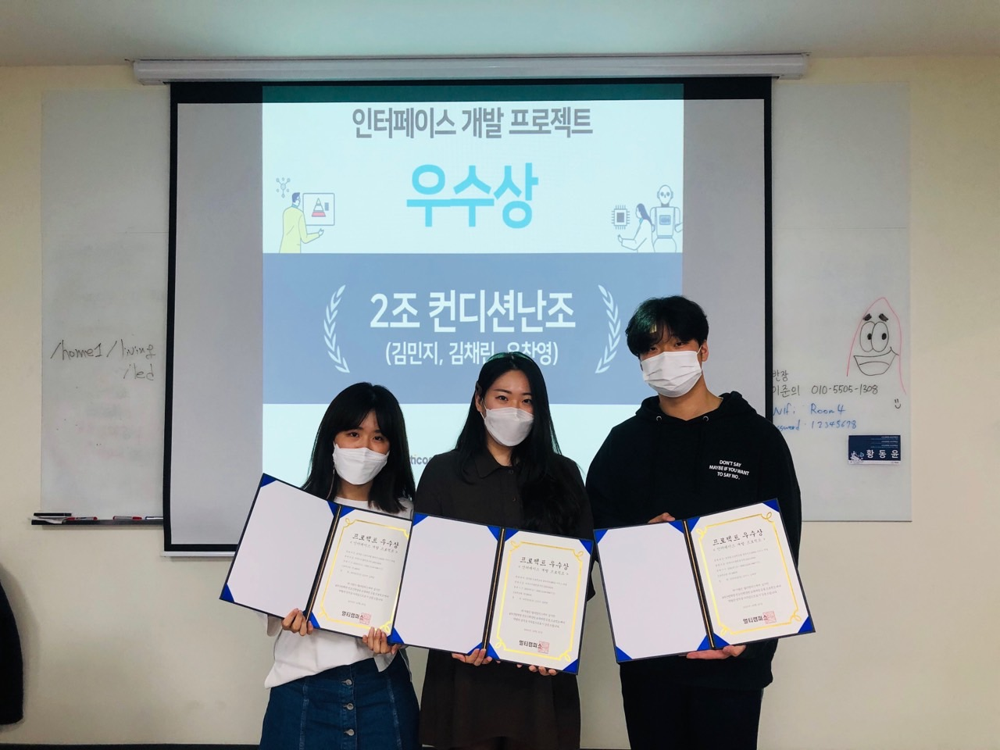
